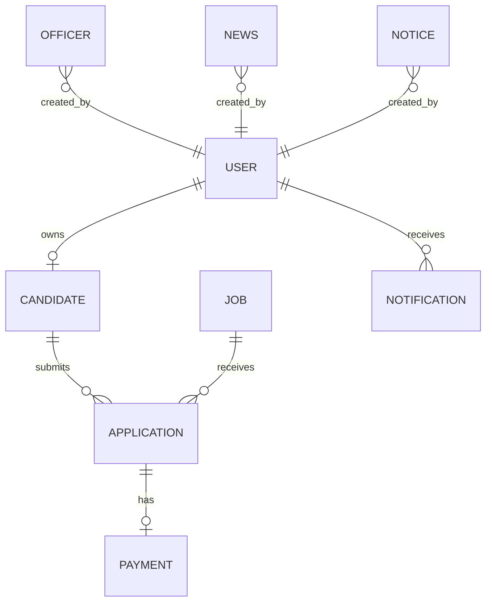

# Database Design

## Core Collections

- `users`: Login identity, role, refresh tokens, password reset and verification state.
- `candidates`: Candidate profile linked to one user.
- `officers`: Company officer directory records.
- `jobs`: Recruitment circulars.
- `applications`: Candidate applications linked to candidate, job, documents, payment, and admit card status.
- `payments`: Gateway transactions and validation result.
- `news`: Published company news.
- `notices`: Notice board entries.
- `gallery`: Public gallery assets.
- `contactmessages`: Contact form submissions.
- `notifications`: Candidate/admin notification history.

## Key Relationships

- User 1:1 Candidate
- Candidate 1:N Application
- Job 1:N Application
- Application 1:1 Payment
- Application 1:1 Admit Card metadata
- User 1:N Notification

## ER Diagram

